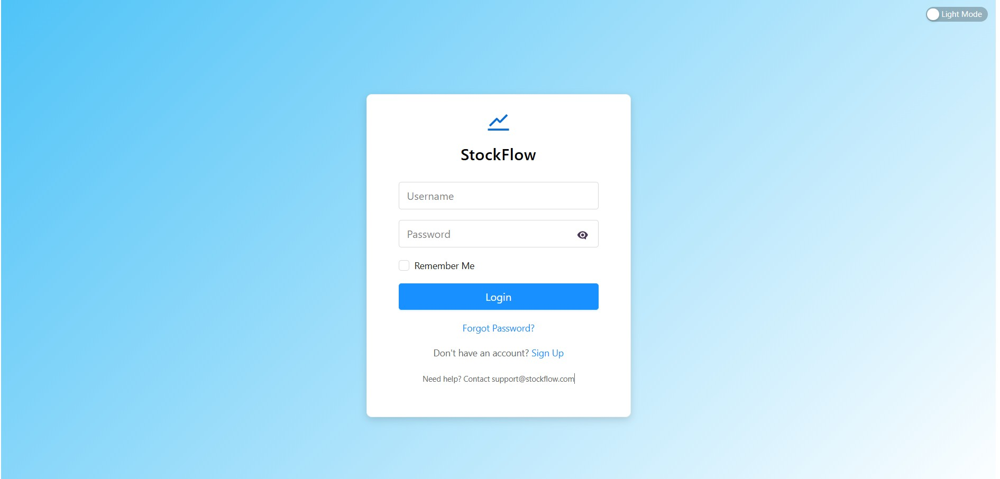
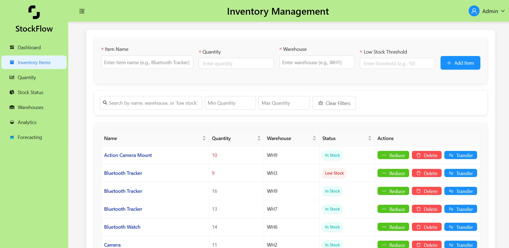
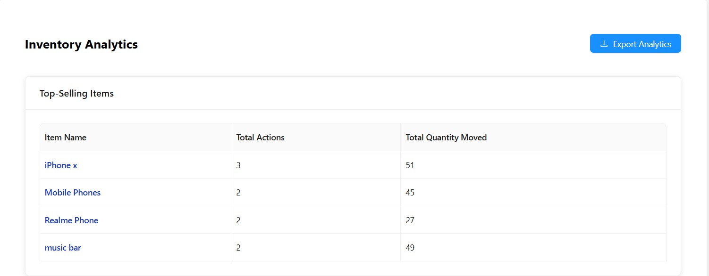
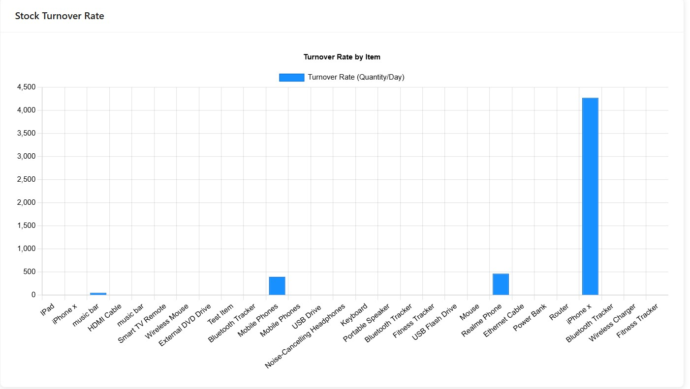
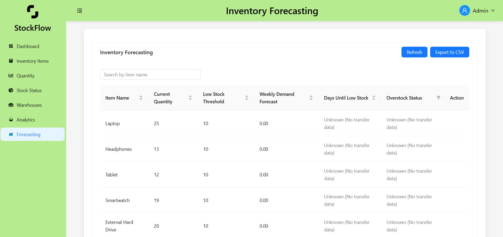
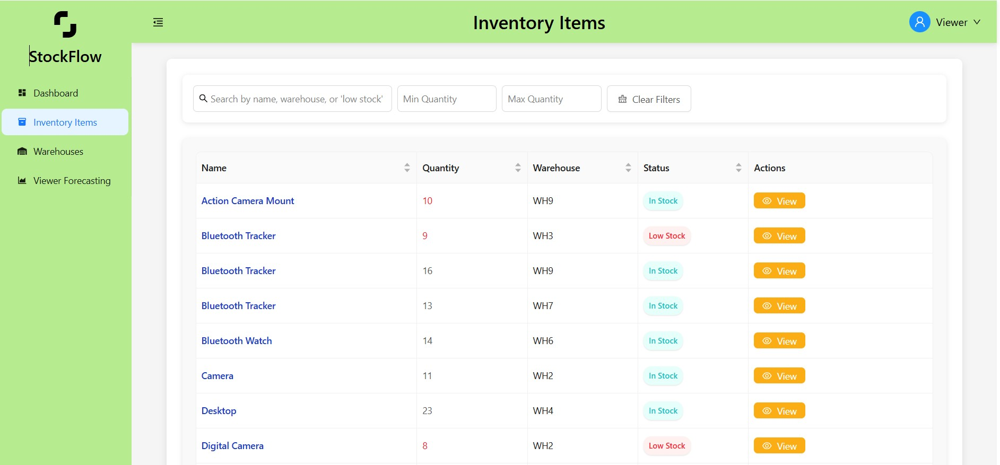
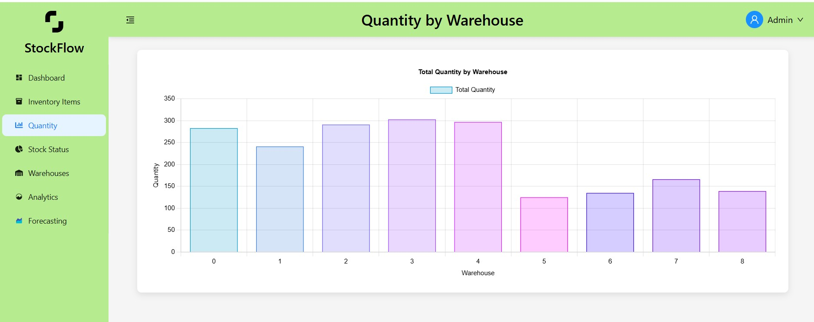
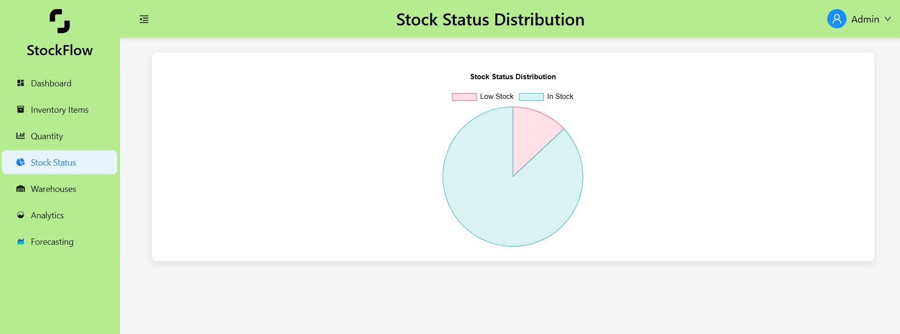

# 📦 StockFlow - The Ultimate Inventory Lifesaver (Because Counting is Hard)

**StockFlow** is the *groundbreaking*, full-stack inventory management web app that ensures businesses don’t lose their minds (or their stock). Because who needs a spreadsheet when you can overcomplicate things with an entire application?

With an almost obsessive focus on **usability, security, and efficiency**, StockFlow gives you the illusion of control over your inventory. Whether you're an **admin** pretending to manage stock or a **viewer** clicking through some charts to look busy, StockFlow has all the *life-changing* tools you need to stay **organized** and **informed**.

---

## ✨ Features That Will *Totally* Change Your Life

✅ **🔒 Role-Based Access Control**  
- Because we can't trust everyone with *critical* inventory decisions. Admins get to play boss, and viewers get to... well, view.

✅ **📱 Responsive UI**  
- Works on *all* devices, so you can panic about low stock even on your phone! Built with **Ant Design** to ensure your UI looks *professionally mediocre*.

✅ **📊 Inventory Management**  
- Perform **CRUD operations** (Create, Read, Update, Delete) on inventory items. Fancy words for "move stuff around."  
- Transfer items between warehouses like a true logistics master.  
- Receive **low stock alerts**, because running out of stock *never* happens at the worst possible time.

✅ **📈 Data Visualization**  
- Stare at colorful **bar charts** and **pie charts** while pretending to analyze stock trends.  
- **Click-to-filter functionality**, for those who enjoy clicking things just to feel productive.

✅ **💾 Data Export**  
- Export your inventory data as **CSV files**, so you can continue ignoring it in Excel instead.

✅ **🔋 Action Logging**  
- Every action is logged, so there’s no denying that Steve from accounting *definitely* deleted those items.

✅ **⚡ Optimized Data Fetching**  
- Uses **TanStack Query** to reduce API calls by **30%**, because who doesn’t love efficiency that you’ll never actually notice?

---

## 🧑‍💻 Tech Stack That Sounds Impressive

### **Frontend**  
- ⚡ **React** – Because every app is built with it these days.  
- 🎨 **Ant Design** – For that sleek "corporate dashboard" feel.  
- ⚡ **TanStack Query** – Makes data fetching slightly less painful.  
- 🌍 **Axios** – Because REST APIs need their coffee too.  
- 🎭 **CSS** – Sprinkles of styling magic (or chaos, depending on the day).  

### **Backend**  
- 🟢 **Node.js** – It’s JavaScript, but on the backend (magic, right?).  
- 🚀 **Express** – Web framework that makes everything seem easier than it actually is.  
- 🌳 **MongoDB** – NoSQL database, because tables are *so last season*.  
- 🗄️ **REST API** – How the frontend and backend communicate when they aren’t arguing.

### **Deployment**  
- 🔺 **Vercel** – Deploying your app faster than you can say "Oops, forgot to test that."

---

## 🖼️ Screenshots (Because You Deserve Visual Proof)

### 🔐 Login Page  
Look at this beauty — where security and sarcasm meet.  


---

### 🧠 Admin Dashboard  
For those who like pretending to be in control.  


---

### 📊 Analytics Page (1)  
Just some colorful charts to make you feel data-savvy.  


---

### 📈 Analytics Page (2)  
Still staring at trends. Still pretending to understand them.  


---

### 🧙‍♂️ Inventory Forecasting (Admin)  
Predict the future like a stock wizard.  


---

### 🧍 Viewer Mode  
Because sometimes, clicking through pretty charts is enough.  


---

### 📊 Pie & Bar Charts  
For when you need to impress people with colorful circles and rectangles.  
**Bar Chart:**  


**Pie Chart:**  



## 🚀 Getting Started (If You Dare)

### **Prerequisites**  
Before you begin, make sure you have these *essential* items installed:
- 🟢 **Node.js** (because JavaScript is life)  
- 🌳 **MongoDB** (because you need somewhere to store your "organized" inventory)  
- 🔺 **Vercel Account** (so you can impress people with a live demo)

### **Installation**  

#### **Clone the Repository**  
```bash
git clone https://github.com/your-username/stockflow.git
cd stockflow
```

#### **Set Up the Backend**  
Navigate to the server directory:  
```bash
cd server
```
Install dependencies:  
```bash
npm install
```
Create a **.env** file and add your MongoDB connection string (because security is *important*):  
```ini
MONGODB_URI=your-mongodb-connection-string
JWT_SECRET=your-jwt-secret
```
Start the backend server:  
```bash
npm start
```

#### **Set Up the Frontend**  
Navigate to the client directory:  
```bash
cd client
```
Install dependencies:  
```bash
npm install
```
Create a **.env** file and add the backend API URL:  
```ini
REACT_APP_API_URL=http://localhost:5000
```
Start the frontend development server:  
```bash
npm start
```

#### **Access the Application**  
Open your browser and navigate to **[http://localhost:3000](http://localhost:3000)** to experience the magic.

---

## 🏠 Deployment (Because Localhost Isn’t Enough)

### **Deploy to Vercel**  
1. Push your code to a **GitHub repository**.  
2. Import the repository into **Vercel**.  
3. Set the following environment variables in **Vercel**:  
   ```ini
   MONGODB_URI=your-mongodb-connection-string
   JWT_SECRET=your-jwt-secret
   ```
4. Deploy the app and act like you knew what you were doing all along.

---

## 🤝 Contributing (Good Luck!)

Contributions are **welcome** (if you dare)! Here’s how to make your mark:
1. **Fork** the repository (because we don’t trust you with direct edits).  
2. Create a **new branch** (`git checkout -b feature/your-feature`).  
3. Make changes and commit (`git commit -m "Add your feature"`).  
4. Push to the branch (`git push origin feature/your-feature`).  
5. Open a **pull request** and hope for the best.

---

💙 If this project made you smile (or cry), don’t forget to **star ⭐** the repository!
